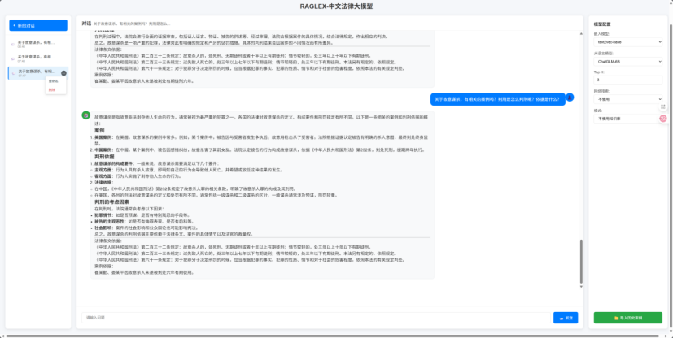
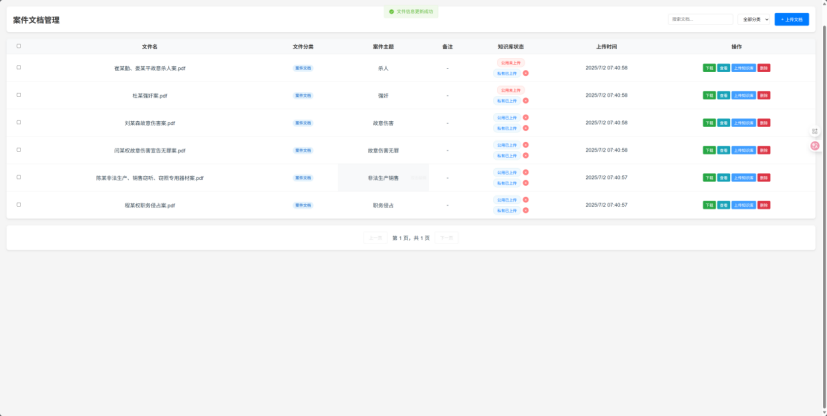

# RAGLEX - 法律领域检索增强生成问答系统

[](LICENSE)


RAGLEX 是一个专为法律领域设计的问答系统。它结合了**检索增强生成 (Retrieval-Augmented Generation, RAG)** 技术，能够基于本地知识库中的法律文档，为用户提供精准、有据可依的回答。

## ✨ 项目特色

* **领域专注**: 深度聚焦于法律领域，提供更专业的问答体验。
* **本地知识库**: 完全基于你提供的本地法律文档进行回答，保证了信息的私密性和可靠性。
* **精准溯源**: 每个回答都能追溯到原文出处，方便用户核实信息来源。
* **前后端分离**: 采用现代化的前后端分离架构，易于维护和扩展。
* **Web 界面**: 提供简洁直观的 Web 交互界面，用户体验友好。

## 📸 系统预览

<table>
  <tr>
    <td align="center">
      <p><b>智能问答界面</b></p>
      
    </td>
    <td align="center">
      <p><b>知识库文件管理</b></p>
      
    </td>
  </tr>
</table>

## 🔧 技术栈

* **后端**:
    * **框架**: FastAPI
    * **核心引擎**: LangChain
    * **向量数据库**: ChromaDB
    * **权限数据库**: SQLite
    * **模型**: Sentence-Transformers (用于文本嵌入), FlagReranker (用于重排序), 以及任何兼容的 LLM (如 ChatGLM, Llama, GPT 等)
* **前端**:
    * **框架**: Vue 3
    * **UI 库**: Element Plus
* **部署**: Shell 脚本 (`deploy.sh`)

## 🚀 快速开始

请按照以下步骤在本地环境中安装和运行本项目。

### 1. 克隆项目

```bash
git clone [https://github.com/gstranded/RAGLEX.git](https://github.com/gstranded/RAGLEX.git)
cd RAGLEX
```

### 2. 配置环境与依赖

* **后端**: 创建并激活 Python 虚拟环境，然后安装依赖。
    ```bash
    # 进入后端目录
    cd law_backend_flask  # 注意：这里可能需要根据实际情况调整目录名

    # 创建虚拟环境
    python -m venv venv
    # 激活虚拟环境 (Linux/macOS)
    source venv/bin/activate
    # 激活虚拟环境 (Windows)
    # venv\Scripts\activate

    # 安装依赖
    pip install -r requirements.txt
    ```

* **前端**: 安装 Node.js 依赖。
    ```bash
    # (在项目根目录) 进入前端目录
    cd law_front

    # 安装依赖
    npm install
    ```

### 3. 环境变量配置

**这是启动服务的关键前提步骤。** 本项目需要 API 密钥等敏感信息，这些信息通过环境变量进行配置。

1.  在后端代码目录 (`law_backend_flask`) 下，找到 `.env.example` 文件。
2.  复制该文件并重命名为 `.env`。
3.  编辑 `.env` 文件，填入您的个人密钥和配置信息。

一个典型的 `.env` 文件内容如下：

```env
# OpenAI API Key
OPENAI_API_KEY="sk-..."

# Serper API Key for Web Search
SERPER_API_KEY="..."

# API Base (如果使用代理或特定服务)
OPENAI_API_BASE="[https://api.gptsapi.net/v1](https://api.gptsapi.net/v1)"
DEEPSEEK_API_BASE="[https://api.deepseek.com/v1](https://api.deepseek.com/v1)"
```

### 4. 准备并初始化知识库

1.  **准备文档**: 将你的法律文档（如 `.txt`, `.md`, `.pdf` 文件）放入项目根目录下的 `data` 或 `config.py` 中指定的路径下。
2.  **初始化数据库**: **首次运行前必须执行此步骤**。该脚本会加载、处理文档，并将其向量化存入 ChromaDB。
    ```bash
    # (在后端代码目录中) 运行数据库加载脚本
    python reload_database.py
    ```

### 5. 启动服务

* **启动后端 FastAPI 服务**:
    后端服务是一个由 `receive_data.py` 文件定义的 FastAPI 应用。它负责接收前端的所有 API 请求，并驱动整个问答和知识库管理流程。我们使用 `uvicorn` 来运行这个应用。

    ```bash
    # (在后端代码目录中)
    # 使用 uvicorn 启动 receive_data.py 中定义的 app
    uvicorn receive_data:app --host 0.0.0.0 --port 10086 --reload
    ```
    * `receive_data:app` 指的是运行 `receive_data.py` 文件中的 `app` 实例。
    * `--reload` 参数会使服务在代码变更后自动重启，非常适合开发环境。
    * 服务成功启动后，后端 API 会监听在 `http://0.0.0.0:10086`。

* **启动前端开发服务器**:
    ```bash
    # (在项目根目录) 进入前端目录
    cd law_front

    # 启动前端服务
    npm run serve
    ```
    前端服务启动后，你可以在浏览器中打开提示的地址 (通常是 `http://localhost:8080`) 来访问问答系统。

## 📂 项目结构

### 高层结构
```
RAGLEX/
│
├── data/                    # 存放本地知识库源文件
├── law_backend_flask/       # 后端应用核心代码
├── law_front/               # 前端 Vue 应用
├── deploy.sh                # 自动化部署脚本
├── DEPLOYMENT.md            # 详细的部署指南
├── LICENSE                  # 项目许可证
└── README.md                # 你正在阅读的文件
```
### 后端核心模块结构
```
law_backend_flask/
│
├── receive_data.py          # FastAPI 应用主入口，负责API接收和业务编排
├── permission_manager.py    # 权限控制核心，管理SQLite数据库
├── utils.py                 # 基础工具与核心算法库（模型加载、向量库操作等）
├── config.py                # 系统全局配置文件
├── reload_database.py       # 知识库重新加载与初始化脚本
├── complete_qa_test.py      # 完整的RAG问答流程蓝图与测试脚本
├── chains.py                # LangChain 链的定义
├── prompt.py                # 所有Prompt模板
├── loader.py                # 文档加载逻辑
├── splitter.py              # 文档分割逻辑
├── requirements.txt         # Python 依赖
└── ...                      # 其他辅助模块
```


## 🚀 后端核心系统详解

这部分代码构成了 RAGLEX 问答系统的核心后端，负责处理从知识库管理到智能问答的全流程业务逻辑。系统采用模块化设计，具备高内聚、低耦合的特点，易于维护和扩展。

### 核心架构

系统整体上是一个基于 **检索增强生成 (RAG)** 的高级问答架构，其核心可以分为以下几个层面：

1.  **API 服务层 (`receive_data.py`)**:
    * 使用 **FastAPI** 框架构建，作为系统的前端入口，负责接收所有外部请求。
    * 提供两大核心接口：知识库管理 (`/api/receive-knowledge`) 和智能问答 (`/api/chat`)。

2.  **权限与数据管理层 (`permission_manager.py`)**:
    * 使用 **SQLite** 数据库 (`knowledge_files.db`) 持久化文件元数据和用户权限。
    * 通过 `files` 和 `file_permissions` 两个表，实现了对每个知识库文档精细化的公有/私有权限控制，是实现多用户数据隔离的关键。

3.  **知识处理与向量化层 (`utils.py`, `reload_database.py`)**:
    * 使用 **ChromaDB** 作为向量数据库，持久化存储文档的向量表示。
    * 支持对法律条文和案例两种不同类型的文档进行**分离式处理**，包括使用不同的切割参数和存储到不同的向量集合中。
    * 提供完整的脚本 (`reload_database.py`) 用于一键式地重新加载和索引所有知识库文档。

4.  **智能问答管线 (RAG Pipeline)** (`complete_qa_test.py`, `receive_data.py`):
    * 这是一套精密的、多步骤的问答处理流程，旨在最大化回答的准确性和相关性。
    * 完整流程在 `complete_qa_test.py` 中有清晰的定义和测试，并在 `receive_data.py` 中被实际调用。

### ✨ 系统亮点

* **分离式文档处理**: 系统明确区分“法律条文”和“案例”文档，在存储、检索和后处理中采用不同的策略，以提升各自领域问答的专业性。
* **精细化权限控制**: 内置了完整的用户权限管理体系，支持文件级别的公有/私有设置，保证了多用户场景下的数据安全与隔离。
* **先进的 RAG 流程**: 整合了业界先进的 RAG 技术，包括意图识别、多路查询、向量检索、关键词检索（BM25）、模型重排序（Reranking）和可选的联网搜索，流程完整且逻辑严密。
* **文档内容深度处理**: 在接收新知识文件时，系统能调用大语言模型（LLM）对非结构化文本进行自动分析和结构化，提取关键信息并格式化存档，提升了知识库的质量。
* **高度模块化与可配置**: 项目结构清晰，功能分散在不同模块中（如 `utils.py`, `permission_manager.py`），核心参数通过 `config.py` 统一管理，易于二次开发和维护。

### 关键模块详解

#### `receive_data.py`: API 服务与业务流程编排
这是系统的总入口和指挥中心。
* **知识库管理**: 通过 `/api/receive-knowledge` 接口接收文件上传 (`add`) 和删除 (`cancel`) 的请求。 对新上传的文件，它会调用 LLM 进行深度加工，并完成文件存档、数据库注册和向量化入库的全套流程。
* **聊天接口**: `/api/chat` 接口驱动整个问答流程，根据用户请求中的 `mode` 参数（如 `shared_knowledge`, `private_knowledge` 等）来调用不同的知识检索策略，实现权限控制。

#### `permission_manager.py`: 精细化权限控制核心
该模块为系统提供了企业级的多租户数据隔离能力。
* **核心功能**: 围绕“用户-文件-权限”三个维度，提供了添加、删除、查询文件和权限的完整原子操作。
* **安全保障**: 在进行任何与案例相关的知识库检索前，系统会先调用 `get_user_accessible_file_ids` 函数获取当前用户有权访问的文件ID列表，从根源上杜绝了数据越权访问的可能。

#### `utils.py`: 基础工具与核心算法库
这个文件是整个项目的“工具箱”，包含了所有底层的核心功能实现。
* **模型加载**: 封装了 `HuggingFaceBgeEmbeddings` (文本嵌入) 和 `FlagReranker` (重排序) 等模型的加载逻辑。
* **向量库操作**: 提供了与 ChromaDB 交互的接口，如获取、清除、索引数据等。
* **分离式检索与重排序**: 实现了 `search_law_documents` 和 `search_case_documents` 函数，能够针对不同类型的文档使用不同的检索和后处理逻辑。
* **GPU 资源管理**: 包含清理 GPU 显存的函数，对于部署在有限资源环境下的模型服务至关重要。

#### `complete_qa_test.py`: 智能问答流程的“蓝图”
这个测试文件清晰地定义了整个 RAG 问答管线的每一个步骤，是理解系统工作流的最佳参考。
1.  **问题补全**: 结合对话历史，将用户的短问题补全为一个更清晰、完整的查询。
2.  **意图识别**: 判断用户问题是否属于“法律”领域，以决定后续的处理策略。
3.  **多查询生成**: 将一个复杂问题分解为多个角度的子查询，提升召回率。
4.  **分离式检索**: 分别从“法律条文库”和“案例库”中检索相关文档。
5.  **文档重排序**: 使用更先进的 `reranker` 模型对初步检索出的文档列表进行重新排序，提升最相关文档的排名。
6.  **联网搜索**: (可选) 调用外部搜索引擎（Serper API）获取最新的网络信息作为补充。
7.  **生成最终答案**: 将所有处理过的上下文信息提交给大语言模型，生成最终的、有理有据的答案。

## 📜 部署

本项目提供了一键部署脚本 `deploy.sh`。有关详细的生产环境部署步骤，请参考 [DEPLOYMENT.md](DEPLOYMENT.md)。

## 🙏 致谢

在 `RAGLEX` 项目的开发过程中，我们参考了用户 **leocandoit** 的开源项目 **[LawBrain](https://github.com/leocandoit/LawBrain)** 中的部分代码和设计思路。该项目为我们提供了宝贵的灵感和实践参考。

在此，向 `leocandoit` 的开源贡献表示诚挚的感谢！

## 📄 许可证

本项目采用 MIT 许可证。详情请见 [LICENSE](LICENSE) 文件。
