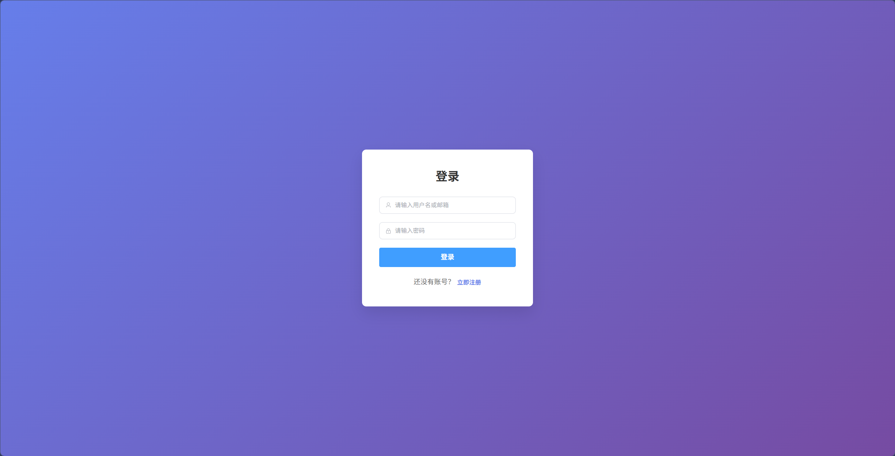
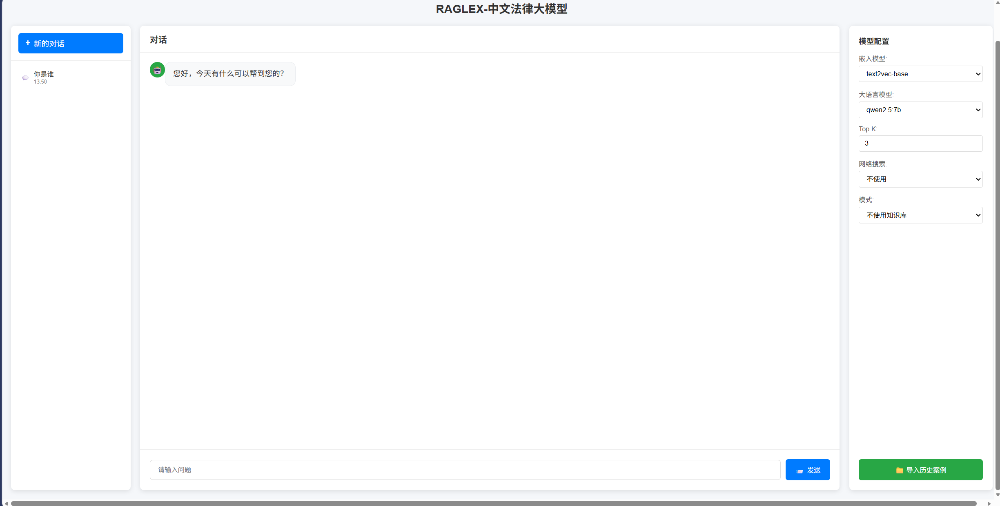
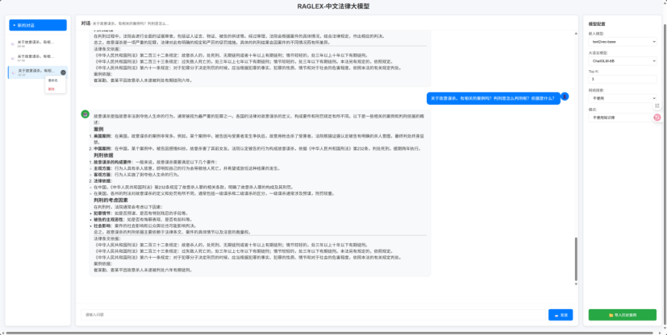
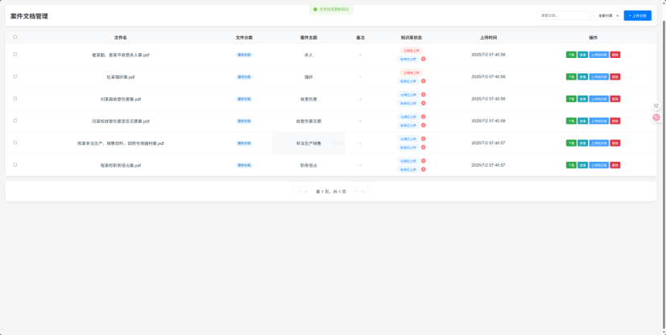
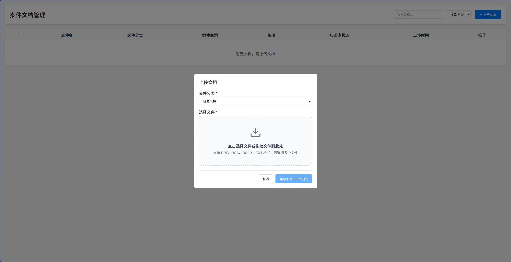

# RAGLEX

[](LICENSE)


RAGLEX 是一个面向法律场景的知识库问答系统，包含：

- Vue 3 前端
- Flask 后端
- 本地知识库上传、切片、检索
- 公有 / 私有知识库隔离
- 可选联网搜索增强
- 会话历史持久化
- 任意 OpenAI-compatible 模型接入

当前仓库默认推荐的运行链路是：

`law_front -> law_backend_flask -> SQLite + 本地文件存储 -> 本地知识检索 -> OpenAI-compatible LLM`

这条链路不依赖私有 IP，也不强制依赖 MinIO / MySQL / 独立 FastAPI RAG 服务，适合直接开源发布和本地复现。

## 系统截图

### 1. 登录页

<p align="center">
  
</p>

### 2. 对话主页

<p align="center">
  
</p>

### 3. 智能问答界面

<p align="center">
  
</p>

### 4. 案件文档管理页

<p align="center">
  
</p>

### 5. 文件管理页

<p align="center">
  
</p>

### 6. 上传文档弹窗

<p align="center">
  
</p>

---


## 功能特性

- 用户注册、登录、对话历史管理
- 文件上传、下载、预览、删除
- 私有知识库上传与检索
- 公有知识库上传与检索
- 取消知识库上传后立即失效
- 回答附带来源片段
- MinIO 不可用时自动回退到本地文件存储
- 支持接入 Ollama、LM Studio、vLLM、OpenAI、OneAPI 等 OpenAI-compatible 推理服务

## 推荐部署方式

### 方式 A：本地 Ollama，零私有依赖，最适合 GitHub 用户

1. 安装 Ollama  
   官方下载页：<https://ollama.com/download>
2. 启动 Ollama 服务
   ```bash
   ollama serve
   ```
3. 拉取一个可用模型
   ```bash
   ./scripts/pull_ollama_model.sh
   ```
   默认会拉取 `qwen2.5:7b`。如果机器资源有限，可以手动执行：
   ```bash
   OLLAMA_MODEL=qwen2.5:3b ./scripts/pull_ollama_model.sh
   ```
4. 复制本地环境文件
   ```bash
   cp .env.local.example .env.local
   ```
5. 一键启动
   ```bash
   ./deploy.sh
   ```
6. 打开前端
   ```text
   http://127.0.0.1:13000
   ```

### 方式 B：接入任意 OpenAI-compatible 服务

如果你已经有现成的推理服务，只要它兼容 OpenAI API，就可以在 `.env.local` 中配置：

```env
OPENAI_COMPAT_BASE_URL=https://your-endpoint.example.com/v1
OPENAI_COMPAT_API_KEY=your-api-key
OPENAI_CHAT_MODEL=your-model-name
```

然后直接启动：

```bash
./deploy.sh
```

## 5 分钟快速开始

### 1. 克隆仓库

```bash
git clone https://github.com/gstranded/RAGLEX.git
cd RAGLEX
```

### 2. 准备本地配置

```bash
cp .env.local.example .env.local
```

默认配置已经适合本地最小运行：

- SQLite
- MinIO 关闭，自动改用本地文件存储
- 使用本地 Ollama `http://127.0.0.1:11434/v1`
- 默认模型 `qwen2.5:7b`
- `sqlite:///...` 这类相对路径会由一键脚本自动解析到仓库根目录

### 3. 准备模型

```bash
ollama serve
./scripts/pull_ollama_model.sh
```

### 4. 一键启动

```bash
./deploy.sh
```

启动后可用地址：

- 前端：`http://127.0.0.1:13000`
- 后端：`http://127.0.0.1:5000`
- 健康检查：`http://127.0.0.1:5000/api/health`

### 5. 一键回归测试

```bash
./scripts/smoke_local.sh
```

这个脚本会验证：

- 后端是否能正常启动
- 前端是否能正常构建
- 注册 / 登录
- 会话创建
- 文件上传 / 下载
- 私有知识库上传 / 检索
- 公有知识库上传 / 检索
- 取消公有知识库上传后检索失效
- 会话历史是否落库

如果你要跑更完整的链路回归，可以执行：

```bash
./scripts/regression_local.sh
```

它会额外覆盖：

- 文件批量上传
- 公转私 / 私转公知识库切换
- 批量上传到知识库（含进度接口）
- 批量删除文件后的知识清理
- 对话权限校验
- 联网搜索问答

## 模型说明

### 当前默认模型接入方式

项目默认不在仓库中内置大模型权重，而是通过 OpenAI-compatible API 调用模型服务。

推荐默认组合：

- 推理服务：Ollama
- 模型：`qwen2.5:7b`
- API Base：`http://127.0.0.1:11434/v1`
- API Key：`ollama`

### 如何更换模型

只需要改 `.env.local`：

```env
OPENAI_CHAT_MODEL=qwen2.5:3b
```

或者使用别的兼容模型：

```env
OPENAI_CHAT_MODEL=gpt-4o-mini
```

如果你还没拉取 Ollama 模型，可以直接执行：

```bash
OLLAMA_MODEL=qwen2.5:3b ./scripts/pull_ollama_model.sh
```

脚本会自动读取 `OLLAMA_MODEL`，并在结束时打印推荐的 `.env.local` 配置。

### 前端里的“模型配置”如何生效

- 默认本地模式下，真正决定后端生成模型的是 `OPENAI_CHAT_MODEL`
- 前端下拉框里的“大语言模型”会作为请求参数传给后端
- 如果你填写的是兼容端点中实际存在的模型名，后端会优先使用它
- 如果前端选的是旧版兼容占位值，例如 `ChatGLM-6B`，后端会回退到 `.env.local` 里的 `OPENAI_CHAT_MODEL`

### 为什么默认不需要单独下载 embedding 模型

当前默认开源部署链路使用的是本地切片检索，不依赖额外的向量 embedding 模型，因此：

- 不需要下载 `bge-large-zh-v1.5`
- 不需要下载 `FlagReranker`
- 不需要单独启动 `RAGLEX-main`

前端中的“嵌入模型”下拉框目前保留主要是为了兼容旧界面。

## 知识库使用流程

1. 注册并登录
2. 进入“文件管理”
3. 上传 PDF / DOCX / TXT / JSON 文件
4. 选择上传到：
   - 公有知识库
   - 私有知识库
5. 回到问答页面，选择模式：
   - `使用公有知识库`
   - `使用私有知识库`
   - `使用整个知识库`
   - `不使用知识库`
6. 如需联网搜索补充，可把“网络搜索”切到 `使用`
7. 提问并查看答案与来源

## 一键脚本

| 脚本 | 作用 |
|---|---|
| `./deploy.sh` | 一键本地部署，启动前后端 |
| `./scripts/bootstrap_python.sh` | 创建 `.venv` 并安装后端依赖 |
| `./scripts/run_backend_sqlite.sh` | 用 SQLite + 本地文件存储启动后端 |
| `./scripts/run_frontend.sh` | 启动前端开发服务器 |
| `./scripts/start_local.sh` | 后台启动前后端并写入 PID / 日志 |
| `./scripts/stop_local.sh` | 停止前后端 |
| `./scripts/status_local.sh` | 查看本地服务状态 |
| `./scripts/pull_ollama_model.sh` | 拉取默认 Ollama 模型 |
| `./scripts/smoke_local.sh` | 运行完整本地 smoke 测试 |
| `./scripts/regression_local.sh` | 运行更完整的功能回归测试 |

## 常用命令

### 启动

```bash
./deploy.sh
```

### 停止

```bash
./scripts/stop_local.sh
```

### 查看状态

```bash
./scripts/status_local.sh
```

### 运行回归测试

```bash
./scripts/smoke_local.sh
./scripts/regression_local.sh
```

如果后端已经在当前端口健康运行，`smoke_local.sh` 会直接复用现有实例，不会在结束时把你的在线服务停掉。

### 查看日志

```bash
tail -f .logs/backend.log
tail -f .logs/frontend.log
```

## 目录结构

```text
RAGLEX/
├── law_backend_flask/        # Flask 后端
├── law_front/                # Vue 前端
├── RAGLEX-main/              # 旧版独立 RAG 服务（保留，非默认链路）
├── picture/                  # README 截图
├── scripts/                  # 一键部署、启动、回归测试脚本
├── .env.local.example        # 本地配置模板
├── README.md                 # 项目说明
├── RUN_LOCAL.md              # 最小本地启动说明
├── DEPLOYMENT.md             # 部署与运维说明
└── deploy.sh                 # 一键本地部署入口
```

## 本地数据落盘位置

- SQLite：`law_backend_flask/data/raglex-dev.sqlite3`
- 本地对象存储：`law_backend_flask/data/local_object_store/`
- 运行日志：`.logs/`
- PID 文件：`.run/`

## 关于 `RAGLEX-main`

仓库里保留了 `RAGLEX-main/` 目录，它是历史上的独立 FastAPI / LangChain / Chroma 实验实现。

当前默认推荐部署时：

- 不需要启动它
- 不需要下载它依赖的 embedding / reranker 模型
- 不需要单独维护 `10086` 端口服务

如果你确实要继续研究旧实现，可以自行进入该目录做二次开发，但它不是本仓库当前默认的开源运行路径。

## 生产部署建议

如果你要上线到服务器，建议至少做这几件事：

1. 把 `.env.local` 中的密钥改掉
2. 把 `BACKEND_HOST` / `FRONTEND_HOST` 改成 `0.0.0.0`
3. 用 Nginx / Caddy 反代前后端
4. 用 systemd / supervisord 托管 `start_local.sh`
5. 定期备份 `law_backend_flask/data/`

更详细的部署说明见：[DEPLOYMENT.md](./DEPLOYMENT.md)

## 致谢

项目早期设计参考了开源项目 [LawBrain](https://github.com/leocandoit/LawBrain) 的部分思路，在此表示感谢。

## 许可证

MIT，见 [LICENSE](./LICENSE)
